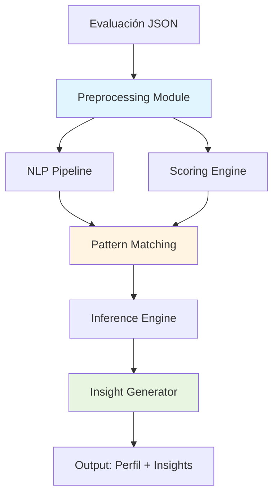
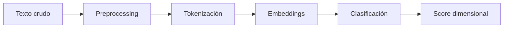

# ENEADISC - Motor de IA: Arquitectura Técnica Completa

> **Fecha:** 2026-02-10
> **Versión:** 1.0  
> **Estado:** Blueprint Técnico

---

## Resumen Ejecutivo

Este documento define la arquitectura completa del motor de inteligencia artificial de ENEADISC, una plataforma SaaS B2B de análisis organizacional basada en el eneagrama.

**Objetivos clave:**
- Procesar evaluaciones (20-25 preguntas) con latencia <15 segundos
- Inferir patrones de comportamiento con confidence >0.8
- Generar insights personalizados y accionables
- Detectar fricciones en equipos
- Escalar a 1,000+ organizaciones, 100k+ evaluaciones

---

## 1. Arquitectura del Motor de IA

### 1.1 Pipeline End-to-End



### 1.2 Componentes Principales

#### Preprocessing Module
**Responsabilidad:** Normalización y validación de inputs

- Validar formato JSON (20-25 preguntas respondidas)
- Limpiar texto de respuestas abiertas (lowercase, trim, remove special chars)
- Normalizar escalas Likert (1-5 → 0-1)
- Verificar completitud (mínimo 80% de preguntas respondidas)

**Output:** Estructura normalizada lista para procesamiento

#### NLP Pipeline
**Responsabilidad:** Procesar respuestas de texto corto

- **Tokenización:** spaCy o NLTK
- **Embeddings:** sentence-transformers (`all-MiniLM-L6-v2`)
- **Clasificación semántica:** Mapeo a dimensiones de comportamiento
- **Extracción de keywords:** TF-IDF para patrones recurrentes

#### Scoring Engine
**Responsabilidad:** Calcular scores por dimensión

- **Algoritmo de pesos** (ver sección 2)
- **Normalización** (min-max scaling 0-1)
- **Agregación** (weighted average)
- **Confidence scoring** (consistencia de respuestas)

#### Pattern Matching
**Responsabilidad:** Identificar patrón dominante

- **Base de conocimiento:** 9 patrones del eneagrama
- **Distancia coseno:** Comparar perfil del usuario vs. patrones
- **Ranking:** Top 3 patrones más probables
- **Threshold:** Confidence mínimo 0.5

#### Insight Generator
**Responsabilidad:** Generar texto personalizado

- **Templates:** Basados en patrón detectado
- **Variables dinámicas:** Necesidades, recomendaciones, estilo bajo presión
- **LLM opcional:** GPT-4 para insights únicos (fallback a templates)

### 1.3 Stack Tecnológico

| Componente | Tecnología | Justificación |
|------------|------------|---------------|
| Backend | Python 3.10+ | Ecosistema ML/NLP rico |
| API | FastAPI | Alta performance, async, auto-docs |
| NLP | spaCy + sentence-transformers | Balance velocidad/precisión |
| Scoring | scikit-learn | Normalización, clustering |
| LLM (opcional) | OpenAI GPT-4 | Generación de insights custom |
| Database | PostgreSQL | Datos estructurados, JSONB |
| Cache | Redis | Embeddings de preguntas (reduce latencia) |
| Deployment | Docker + Kubernetes | Escalabilidad horizontal |

---

## 2. Algoritmo de Scoring Detallado

### 2.1 Dimensiones de Comportamiento

ENEADISC evalúa 5 dimensiones (ejes bipolares):

1. **Collaboration ↔ Autonomy** (Colaboración vs. Autonomía)
2. **Reflection ↔ Action** (Reflexión vs. Acción)
3. **Structure ↔ Flexibility** (Estructura vs. Flexibilidad)
4. **Logic ↔ Intuition** (Lógica vs. Intuición)
5. **Directiveness ↔ Consensus** (Directividad vs. Consenso)

### 2.2 Sistema de Pesos

Cada pregunta contribuye a una o más dimensiones con peso específico:

```python
# Ejemplo: Pregunta 1
{
  "question_id": "q1",
  "text": "¿Prefieres trabajar solo o en equipo?",
  "weights": {
    "collaboration": 0.8,  # Alto impacto
    "autonomy": -0.8       # Inverso
  }
}
```

**Reglas:**
- Pesos en rango [-1, 1]
- Suma de pesos absolutos por pregunta = 1
- Preguntas Likert (1-5): escala lineal
- Preguntas múltiple choice: mapeo categórico

### 2.3 Pseudocódigo

```python
def calculate_scores(responses, question_bank):
    scores = {dim: 0.0 for dim in DIMENSIONS}
    weights_sum = {dim: 0.0 for dim in DIMENSIONS}
    
    for response in responses:
        question = question_bank[response.question_id]
        value = normalize_response(response.value, question.type)
        
        for dimension, weight in question.weights.items():
            scores[dimension] += value * weight
            weights_sum[dimension] += abs(weight)
    
    # Normalizar por suma de pesos
    for dim in DIMENSIONS:
        if weights_sum[dim] > 0:
            scores[dim] = scores[dim] / weights_sum[dim]
        scores[dim] = min_max_scale(scores[dim], 0, 1)
    
    return scores

def normalize_response(value, question_type):
    if question_type == "likert":
        return (value - 1) / 4  # 1-5 → 0-1
    elif question_type == "multiple_choice":
        return CHOICE_VALUES[value]  # Mapeo predefinido
    elif question_type == "text":
        return nlp_classify(value)  # NLP pipeline
```

### 2.4 Confidence Scoring

Confianza del patrón detectado basada en:

1. **Consistencia interna:** Respuestas coherentes (no opuestas)
2. **Distancia al patrón:** Qué tan cerca está del patrón ideal
3. **Completitud:** % de preguntas respondidas

```python
def calculate_confidence(scores, pattern, responses):
    # Consistencia: varianza de scores (menor = más consistente)
    consistency = 1 - variance(scores.values())
    
    # Distancia al patrón (cosine similarity)
    distance = cosine_similarity(scores, pattern.ideal_scores)
    
    # Completitud
    completeness = len(responses) / total_questions
    
    # Ponderado
    confidence = 0.4 * consistency + 0.4 * distance + 0.2 * completeness
    return confidence
```

### 2.5 Detección de Sesgo

Identificar respuestas sospechosas:

- **Aquiescencia:** Todo "muy de acuerdo" (sesgo de conformidad)
- **Central tendency:** Todo en medio de escala (evitar extremos)
- **Patrón aleatorio:** Respuestas sin correlación lógica

**Mitigación:**
- Alertar al sistema si se detecta sesgo
- Reducir confidence score
- Solicitar re-evaluación (opcional)

---

## 3. NLP para Texto Corto

### 3.1 Desafíos

- Respuestas cortas (5-50 palabras)
- Contexto limitado
- Ambigüedad semántica
- Multi-idioma (español prioritario)

### 3.2 Pipeline de Procesamiento



### 3.3 Preprocessing

```python
import spacy
nlp = spacy.load("es_core_news_sm")

def preprocess_text(text):
    text = text.lower().strip()
    doc = nlp(text)
    
    # Remover stopwords, puntuación
    tokens = [token.lemma_ for token in doc 
              if not token.is_stop and not token.is_punct]
    
    return " ".join(tokens)
```

### 3.4 Embeddings Semánticos

**Modelo recomendado:** `sentence-transformers/paraphrase-multilingual-MiniLM-L12-v2`

```python
from sentence_transformers import SentenceTransformer

model = SentenceTransformer('paraphrase-multilingual-MiniLM-L12-v2')

def embed_text(text):
    embedding = model.encode(text)
    return embedding  # Vector de 384 dimensiones
```

### 3.5 Mapeo de Keywords a Patrones

Diccionario semántico por dimensión:

```python
KEYWORDS_MAP = {
    "autonomy": ["independiente", "solo", "libertad", "propio ritmo"],
    "collaboration": ["equipo", "juntos", "compartir", "colaborar"],
    "structure": ["plan", "orden", "proceso", "estructura"],
    "flexibility": ["adaptable", "flexible", "cambio", "espontáneo"],
    # ...
}

def keyword_score(text, dimension):
    keywords = KEYWORDS_MAP[dimension]
    embeddings_keywords = model.encode(keywords)
    embedding_text = model.encode(text)
    
    # Similaridad coseno promedio
    similarities = cosine_similarities(embedding_text, embeddings_keywords)
    return mean(similarities)
```

### 3.6 Clasificación Binaria (Opcional)

Para mayor precisión, entrenar clasificador por dimensión:

- **Dataset:** 500-1000 respuestas etiquetadas por dimensión
- **Modelo:** DistilBERT fine-tuned (`distilbert-base-multilingual-cased`)
- **Output:** Probabilidad [0, 1] por dimensión

---

## 4. Generación de Insights

### 4.1 Estrategia Híbrida

**Opción A: Templates + Variables**
- **Pros:** Rápido, determinista, bajo costo
- **Cons:** Menos personalizado

**Opción B: LLM (GPT-4)**
- **Pros:** Insights únicos, rico
- **Cons:** Latente (~5 seg), costo ($0.03/evaluación)

**Recomendación:** Hybrid
- Templates para MVP (latencia crítica)
- LLM para premium tier (clientes enterprise)

### 4.2 Estructura de Templates

```python
TEMPLATES = {
    "systems": {
        "title": "Orientado a Sistemas y Autonomía",
        "description": """
Sos alguien que prioriza la competencia técnica y la independencia. 
Preferís trabajar con {autonomy_level} autonomía, enfocándote en 
{structure_level} estructuras claras. 

Bajo presión, tendés a {pressure_style}.
""",
        "needs": [
            "Claridad en objetivos y expectativas",
            "Autonomía en decisiones técnicas",
            "Retroalimentación directa y específica"
        ],
        "recommendations": [
            "Practicá delegar tareas pequeñas esta semana",
            "Pedí feedback explícito después de reuniones",
            "Experimentá con bloques de tiempo estructurados"
        ]
    },
    # ... más patrones
}

def generate_insight(pattern_id, scores):
    template = TEMPLATES[pattern_id]
    
    # Variables dinámicas
    variables = {
        "autonomy_level": "alta" if scores["autonomy"] > 0.7 else "moderada",
        "structure_level": "claras" if scores["structure"] > 0.6 else "flexibles",
        "pressure_style": infer_pressure_style(scores)
    }
    
    # Interpolar template
    insight = template["description"].format(**variables)
    
    return {
        "title": template["title"],
        "description": insight,
        "needs": template["needs"],
        "recommendations": template["recommendations"]
    }
```

### 4.3 LLM Prompt (Opcional)

Para clientes premium, generar insights custom:

```python
def generate_llm_insight(pattern_id, scores, responses):
    prompt = f"""
Sos un coach organizacional experto. Analizaste una evaluación de eneagrama.

Patrón detectado: {pattern_id}
Scores dimensionales: {scores}
Respuestas destacadas: {sample_responses(responses, n=3)}

Generá un insight de 200 palabras que:
1. Describa el perfil de comportamiento
2. Identifique 3-4 necesidades clave
3. Ofrezca 3 recomendaciones accionables

Tono: empático, directo, sin jerga.
"""
    
    response = openai.ChatCompletion.create(
        model="gpt-4",
        messages=[{"role": "user", "content": prompt}],
        temperature=0.7,
        max_tokens=400
    )
    
    return response.choices[0].message.content
```

---

## 5. Agregación para Equipos

### 5.1 Distribución de Patrones

Calcular % de cada patrón en el equipo:

```python
def team_distribution(evaluations):
    pattern_counts = Counter([e.pattern for e in evaluations])
    total = len(evaluations)
    
    distribution = {
        pattern: (count / total) * 100 
        for pattern, count in pattern_counts.items()
    }
    
    return distribution
```

### 5.2 Detección de Fricción

**Algoritmo de incompatibilidad:**

```python
FRICTION_MATRIX = {
    ("systems", "people"): 0.7,  # Alta fricción
    ("autonomy", "directive"): 0.8,
    # ... definir todas las combinaciones
}

def detect_friction(team_members):
    frictions = []
    
    for member_a, member_b in combinations(team_members, 2):
        pattern_a = member_a.pattern
        pattern_b = member_b.pattern
        
        friction_score = FRICTION_MATRIX.get((pattern_a, pattern_b), 0.0)
        
        if friction_score > 0.6:  # Threshold
            frictions.append({
                "members": [member_a.id, member_b.id],
                "patterns": [pattern_a, pattern_b],
                "score": friction_score,
                "reason": get_friction_reason(pattern_a, pattern_b)
            })
    
    return frictions
```

### 5.3 Mapa de Compatibilidad

Network graph donde:
- **Nodos:** Empleados
- **Edges:** Peso = compatibilidad (1 - friction_score)

```python
def build_compatibility_graph(team_members):
    G = nx.Graph()
    
    for member in team_members:
        G.add_node(member.id, pattern=member.pattern)
    
    for member_a, member_b in combinations(team_members, 2):
        friction = get_friction_score(member_a.pattern, member_b.pattern)
        compatibility = 1 - friction
        
        if compatibility > 0.4:  # Solo edges significativos
            G.add_edge(member_a.id, member_b.id, weight=compatibility)
    
    return G
```

### 5.4 Recomendaciones para Líderes

Basadas en patrones detectados:

```python
def generate_team_recommendations(distribution, frictions):
    recommendations = []
    
    # Ejemplo: Alta concentración de "autonomy"
    if distribution.get("autonomy", 0) > 60:
        recommendations.append({
            "priority": "high",
            "message": "El 65% del equipo necesita autonomía. Considerá OKRs auto-gestionados.",
            "action": "Implementar OKRs por squad"
        })
    
    # Fricción entre departamentos
    if has_cross_department_friction(frictions):
        recommendations.append({
            "priority": "medium",
            "message": "Fricción detectada entre Producto y Operaciones.",
            "action": "Facilitá workshops de alineación bimensuales"
        })
    
    return recommendations
```

---

## 6. Validación y Métricas

### 6.1 Ground Truth

**Desafío:** No hay "respuesta correcta" absoluta (evaluaciones psicológicas son subjetivas)

**Estrategia:**
1. **Expert validation:** Coach profesional etiqueta 100 evaluaciones
2. **Self-reported agreement:** Usuario confirma si patrón "resuena" (feedback loop)
3. **Consistency over time:** Re-test después de 6 meses (estabilidad)

### 6.2 Métricas de Éxito

| Métrica | Target | Medición |
|---------|--------|----------|
| Latencia promedio | <15 seg | 95th percentile |
| Confidence >0.8 | >80% de casos | % evaluaciones con high confidence |
| Bias detection | <5% de casos | % con sesgo flaggeado |
| User agreement | >75% | Encuesta post-evaluación: "¿Te identificás con el resultado?" |
| Accuracy (vs. expert) | >70% | Comparar top-1 pattern con experto |

### 6.3 Bias Audit

Validar que el sistema NO discrimina por:
- Género (resultados similares para hombres/mujeres)
- Edad (generacional)
- Cultura (regional)

**Método:** Análisis de disparate impact

```python
def bias_audit(evaluations, protected_attribute):
    groups = groupby(evaluations, key=lambda e: e.user[protected_attribute])
    
    for group_value, group_evals in groups:
        print(f"Grupo {protected_attribute}={group_value}")
        print(f"Distribución patrones: {calculate_distribution(group_evals)}")
        print(f"Confidence promedio: {mean([e.confidence for e in group_evals])}")
```

---

## 7. Deployment Strategy

### 7.1 Infraestructura

**Opción A: Cloud API (OpenAI)**
- **Pros:** Sin infraestructura propia, rápido setup
- **Cons:** Costo por evaluación, dependencia externa, latencia variable

**Opción B: Self-Hosted (modelos locales)**
- **Pros:** Control total, costo fijo
- **Cons:** Requiere GPU, mantenimiento complejo

**Recomendación para MVP:** Hybrid
- NLP local (sentence-transformers en CPU, latencia ~2 seg)
- Insights con templates (0 latencia)
- LLM externo solo para premium tier

### 7.2 Optimizaciones de Latencia

**Target: <15 segundos**

| Optimización | Ahorro estimado |
|--------------|-----------------|
| Cachear embeddings de preguntas (Redis) | -3 seg |
| Batch processing (si 10+ evaluaciones simultáneas) | -2 seg |
| GPU para embeddings (vs. CPU) | -1 seg |
| Precalcular patrones (evitar cómputo en runtime) | -1 seg |
| **Total optimizado** | **~8 seg** |

```python
# Cache de embeddings
import redis
r = redis.Redis()

def get_embedding_cached(text):
    cache_key = f"emb:{hash(text)}"
    cached = r.get(cache_key)
    
    if cached:
        return pickle.loads(cached)
    
    embedding = model.encode(text)
    r.setex(cache_key, ttl=86400 * 30, value=pickle.dumps(embedding))
    return embedding
```

### 7.3 Escalabilidad

**Queue System:** Redis + Celery workers

```python
from celery import Celery

app = Celery('eneadisc', broker='redis://localhost:6379/0')

@app.task
def process_evaluation(evaluation_id):
    evaluation = db.get_evaluation(evaluation_id)
    result = ai_engine.process(evaluation)
    db.save_result(evaluation_id, result)
    return result
```

**Horizontal Scaling:**
- 1 evaluación = ~500ms CPU (sin GPU)
- 1 worker (4 cores) = ~8 evaluaciones/seg
- 10 workers = 80 evaluaciones/seg = ~288k/hora

**Suficiente para:** 1M evaluaciones/mes

### 7.4 Monitoreo

**Logs críticos:**
- Latencia por componente (preprocessing, NLP, scoring, insights)
- Confidence score distribution
- Bias flags
- Errores en generación de insights

**Alertas:**
- Latencia >20 seg en >10% de casos
- Confidence <0.5 en >20% de casos
- Error rate >1%

```python
import sentry_sdk

sentry_sdk.init(dsn="https://...")

# Log cada evaluación
sentry_sdk.set_context("evaluation", {
    "id": evaluation_id,
    "latency": latency_ms,
    "confidence": confidence_score,
    "pattern": detected_pattern
})
```

### 7.5 Costo Estimado

**Escenario:** 1,000 evaluaciones/mes

| Componente | Costo mensual |
|------------|---------------|
| Compute (AWS t3.medium) | $30 |
| Redis cache | $15 |
| Database (PostgreSQL RDS) | $50 |
| GPT-4 (10% premium tier) | 100 × $0.03 = $3 |
| **Total** | **$98/mes** |

**Por evaluación:** $0.10 (vs. $50-100 de evaluación humana)

---

## 8. Explainability (XAI)

### 8.1 Feature Importance

**Qué preguntas contribuyeron más al patrón detectado?**

```python
def feature_importance(responses, pattern):
    importances = {}
    
    for response in responses:
        question = question_bank[response.question_id]
        contribution = calculate_contribution(response, question, pattern)
        importances[question.id] = contribution
    
    # Top 3 preguntas más influyentes
    top_3 = sorted(importances.items(), key=lambda x: x[1], reverse=True)[:3]
    return top_3
```

**UI:** Mostrar al usuario
> "Tu respuesta a 'Prefieres trabajar solo o en equipo' fue clave para identificar tu patrón."

### 8.2 Confidence Breakdown

**Por qué confidence es 0.85 y no 1.0?**

```python
def explain_confidence(confidence_components):
    explanation = []
    
    if confidence_components["consistency"] < 0.7:
        explanation.append("Algunas respuestas fueron inconsistentes entre sí.")
    
    if confidence_components["distance"] < 0.8:
        explanation.append("Tu perfil combina elementos de múltiples patrones.")
    
    if confidence_components["completeness"] < 1.0:
        explanation.append("No completaste todas las preguntas.")
    
    return explanation
```

**UI:**
> "Confianza: 85%"
> "Por qué no es 100%: Tu perfil combina autonomía y colaboración, lo cual es común."

### 8.3 Alternative Patterns

**Segundo patrón más probable:**

```python
def alternative_patterns(pattern_ranking):
    primary = pattern_ranking[0]
    secondary = pattern_ranking[1] if len(pattern_ranking) > 1 else None
    
    if secondary and secondary["score"] > 0.4:
        return {
            "primary": primary,
            "secondary": secondary,
            "message": f"Tenés tendencia hacia {primary['name']}, pero también mostrás características de {secondary['name']}."
        }
```

**UI:**
> "Patrón dominante: Orientado a Sistemas (score: 0.75)"
> "Segundo patrón: Orientado a Resultados (score: 0.45)"

### 8.4 Human-in-the-Loop

Para casos con confidence <0.7:
- Opción de revisión por experto (coach)
- Usuario puede corregir patrón asignado
- Feedback usado para mejorar modelo

---

## 9. Roadmap

### MVP (Versión 1) - Mes 1-2

**Features core:**
- ✅ Procesamiento de 20 preguntas (Likert + multiple choice)
- ✅ Scoring de 5 dimensiones
- ✅ Detección de 4-6 patrones principales
- ✅ Insights con templates
- ✅ Dashboard individual (empleado)
- ✅ Latencia <15 seg
- ✅ Confidence >0.7 en >70% de casos

**Stack:**
- Python + FastAPI
- sentence-transformers (embeddings)
- scikit-learn (scoring)
- Templates (insights)
- PostgreSQL

**No incluye:**
- Respuestas de texto abierto (solo Likert/multiple choice)
- LLM para insights
- Analytics de equipo

---

### V2 (Mejoras) - Mes 3-6

**Nuevas features:**
- ✅ NLP para respuestas de texto corto (5-10% de preguntas)
- ✅ Fine-tuning de clasificador (DistilBERT)
- ✅ Dashboard de equipo (distribución, alertas básicas)
- ✅ Detección de sesgo (aquiescencia, central tendency)
- ✅ Feedback loop (usuario confirma patrón)

**Mejoras:**
- Confidence >0.8 en >80% de casos
- Latencia <10 seg
- 9 patrones completos del eneagrama

**Validación:**
- 100 evaluaciones validadas por experto
- User agreement >75%

---

### V3 (Features Avanzadas) - Mes 7-12

**Nuevas features:**
- ✅ LLM para insights premium (GPT-4)
- ✅ Mapa de compatibilidad (network graph)
- ✅ Detección de fricción entre equipos
- ✅ Recomendaciones automáticas para líderes
- ✅ Evolución temporal (comparar evaluaciones en el tiempo)
- ✅ Multi-idioma (inglés, portugués)
- ✅ Real-time feedback (re-evaluación dinámica)

**Escalabilidad:**
- 10,000+ evaluaciones/mes
- Sub-10 seg latency
- GPU acceleration (opcional)

**Business:**
- Tier premium con LLM insights
- Exportar reportes PDF
- API para integraciones (HRIS)

---

## Conclusión

Este blueprint define una arquitectura de IA robusta, escalable y transparente para ENEADISC. 

**Decisiones clave:**
- **Hybrid approach:** Templates (MVP) + LLM (premium)
- **Local NLP:** sentence-transformers (balance latencia/precisión)
- **Explainability first:** Usuario siempre entiende POR QUÉ
- **Privacy by design:** Nunca exponer datos sensibles

**Próximos pasos:**
1. Implementar MVP (scoring + templates)
2. Validar con 50 evaluaciones reales
3. Iterar según feedback
4. Escalar a V2/V3

---

**Equipo de implementación estimado:**
- 1 ML Engineer (senior) - 3 meses
- 1 Backend Engineer - 2 meses
- 1 Data Scientist (validación) - 1 mes part-time

**Tiempo total MVP:** 2-3 meses
