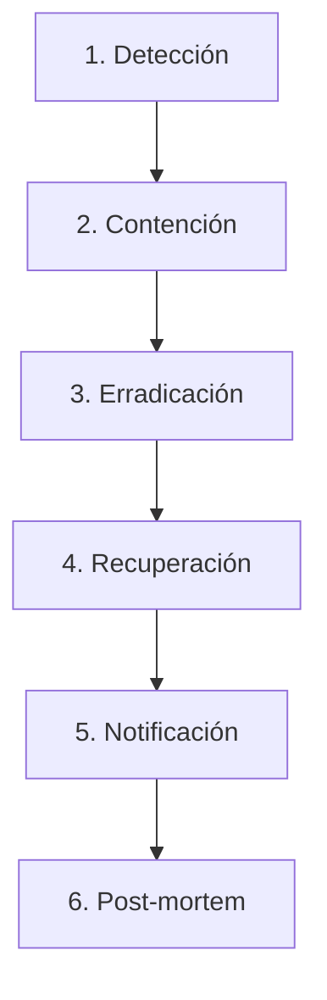

# ENEADISC - Seguridad y Compliance: Documento Completo

> **Fecha:** 2026-02-10
> **Versión:** 1.0
> **Estado:** Security Blueprint

---

## Resumen Ejecutivo

Blueprint de seguridad y compliance para ENEADISC, plataforma SaaS B2B que maneja datos altamente sensibles (evaluaciones psicológicas organizacionales).

**Amenazas principales:**
- Acceso no autorizado
- Data breach
- Multi-tenancy leak (empresa ve datos de otra)
- Uso indebido (discriminación laboral)

**Compliance:**
- GDPR (Europa)
- CCPA (California)
- SOC 2 Type II (futuro, para enterprise)

---

## 1. Threat Model

### Amenazas Identificadas

| # | Amenaza | Impacto | Probabilidad | Mitigación |
|---|---------|---------|--------------|------------|
| 1 | **Acceso no autorizado** (credenciales robadas) | Crítico | Media | MFA obligatorio, rate limiting, session management |
| 2 | **Data breach** (DB expuesta, SQL injection) | Crítico | Baja | Encryption at rest, input validation, RLS |
| 3 | **Multi-tenancy leak** (empresa A ve datos de empresa B) | Crítico | Media | Row-level security, exhaustive testing |
| 4 | **Insider threat** (admin/dev accede a datos sensibles) | Alto | Baja | Audit logging, access controls, encryption |
| 5 | **Manipulación de datos** (líder altera resultados) | Alto | Baja | Immutable logs, versioning, integrity checks |
| 6 | **Denial of Service** (DDoS, resource exhaustion) | Medio | Media | Rate limiting, CDN, auto-scaling |
| 7 | **Social engineering** (phishing a empleados) | Medio | Alta | Security training, MFA, email filtering |

### Matriz de Riesgo

```
Probabilidad
     ↑
Alta │     7
     │                 
Media│  1     3
     │           6
Baja │     2  4  5
     │
     └──────────────→ Impacto
       Bajo  Medio Alto Crítico
```

---

## 2. Security Controls

### 2.1 Authentication

#### Passwords

**Hashing:** bcrypt (cost=12)
```javascript
const bcrypt = require('bcrypt');
const SALT_ROUNDS = 12;

async function hashPassword(password) {
  return await bcrypt.hash(password, SALT_ROUNDS);
}

async function verifyPassword(password, hash) {
  return await bcrypt.compare(password, hash);
}
```

**Políticas:**
- Mínimo 8 caracteres (recomendado: 12+)
- NO forzar rotación periódica (contraproducente)
- Permitir contraseñas largas (hasta 128 chars)
- Permitir todos los caracteres especiales
- Usar dictionary attack prevention (common passwords list)

#### Multi-Factor Authentication (MFA)

**Obligatorio para:** Owners, Admins
**Opcional para:** RRHH, Empleados

**Método:** TOTP (Time-based One-Time Password)
```javascript
const speakeasy = require('speakeasy');

// Generar secret
const secret = speakeasy.generateSecret({
  name: `ENEADISC (${user.email})`
});

// Verificar token
const verified = speakeasy.totp.verify({
  secret: user.mfa_secret,
  encoding: 'base32',
  token: userInputToken,
  window: 1  // ±30 seg
});
```

**Backup codes:** 10 códigos de un solo uso
```javascript
function generateBackupCodes() {
  return Array.from({ length: 10 }, () => 
    crypto.randomBytes(4).toString('hex').toUpperCase()
  );
}
```

#### Session Management

**JWT Tokens:**
```javascript
// Access token (corta vida)
const accessToken = jwt.sign(
  { userId, role, orgId },
  ACCESS_TOKEN_SECRET,
  { expiresIn: '15m', algorithm: 'RS256' }
);

// Refresh token (larga vida, rotación)
const refreshToken = jwt.sign(
  { userId, tokenId: uuid() },
  REFRESH_TOKEN_SECRET,
  { expiresIn: '7d', algorithm: 'RS256' }
);
```

**Logout:**
```javascript
// Blacklist refresh token en Redis
await redis.setex(`blacklist:${refreshToken}`, 604800, '1');  // 7 días
```

**Auto-logout por inactividad:** 60 minutos

#### Código de Empleado (Passwordless)

**Generación:**
```javascript
function generateEmployeeCode(organizationId) {
  // 6 dígitos únicos por organización
  const code = crypto.randomInt(100000, 999999).toString();
  const hash = crypto.createHash('sha256')
    .update(`${organizationId}:${code}`)
    .digest('hex');
  
  return { code, hash };
}
```

**Características:**
- Expira cada 90 días (forzar regeneración)
- Rate limiting: 10 intentos / hora
- Almacenar hash (SHA-256), NO en texto plano

### 2.2 Authorization (RBAC)

#### Matriz de Permisos

| Recurso | Owner | Admin | RRHH | Empleado |
|---------|-------|-------|------|----------|
| Ver analytics agregados | ✅ | ✅ | ✅ | ❌ |
| Ver respuestas crudas individuales | ❌ | ❌ | ❌ | Solo propias |
| Exportar reportes (agregados) | ✅ | ✅ | ✅ | ❌ |
| Exportar reporte individual | ✅ | ✅ | ✅ | Solo propio |
| Invitar empleados | ✅ | ✅ | ✅ | ❌ |
| Eliminar organización | ✅ | ❌ | ❌ | ❌ |
| Modificar configuración | ✅ | ✅ | ❌ | ❌ |
| Cambiar roles | ✅ | ❌ | ❌ | ❌ |

#### Implementación (Middleware)

```javascript
function requireRole(...allowedRoles) {
  return (req, res, next) => {
    if (!allowedRoles.includes(req.user.role)) {
      return res.status(403).json({ error: 'Forbidden' });
    }
    next();
  };
}

// Uso
router.get('/analytics', 
  authenticate, 
  requireRole('owner', 'admin', 'rrhh'), 
  getAnalytics
);
```

#### Row-Level Security (RLS)

**Supabase RLS example:**
```sql
-- Policy: usuarios solo ven datos de su organización
CREATE POLICY org_isolation ON evaluations
  FOR SELECT
  USING (organization_id = auth.jwt() ->> 'organization_id');

-- Policy: empleados solo ven sus propias respuestas
CREATE POLICY employee_self_access ON evaluation_responses
  FOR SELECT
  USING (
    user_id = auth.uid() 
    OR 
    auth.jwt() ->> 'role' IN ('owner', 'admin', 'rrhh')
  );
```

### 2.3 Encryption

#### At Rest

**Respuestas de evaluación** (columnas específicas):
```javascript
const crypto = require('crypto');

function encrypt(text, key) {
  const iv = crypto.randomBytes(16);
  const cipher = crypto.createCipheriv('aes-256-gcm', key, iv);
  
  let encrypted = cipher.update(text, 'utf8', 'hex');
  encrypted += cipher.final('hex');
  
  const authTag = cipher.getAuthTag();
  
  return {
    iv: iv.toString('hex'),
    encrypted,
    authTag: authTag.toString('hex')
  };
}

function decrypt(encryptedData, key) {
  const decipher = crypto.createDecipheriv(
    'aes-256-gcm',
    key,
    Buffer.from(encryptedData.iv, 'hex')
  );
  
  decipher.setAuthTag(Buffer.from(encryptedData.authTag, 'hex'));
  
  let decrypted = decipher.update(encryptedData.encrypted, 'hex', 'utf8');
  decrypted += decipher.final('utf8');
  
  return decrypted;
}
```

**Key management:**
- Usar AWS KMS, GCP KMS, o HashiCorp Vault
- Rotar keys cada 6 meses
- Envelope encryption (master key → data keys)

**Backups:**
```bash
# Encriptar antes de subir a S3
gpg --symmetric --cipher-algo AES256 backup.sql
aws s3 cp backup.sql.gpg s3://eneadisc-backups/
```

#### In Transit

**HTTPS everywhere:**
```nginx
# Nginx config
server {
  listen 443 ssl http2;
  ssl_certificate /path/to/cert.pem;
  ssl_certificate_key /path/to/key.pem;
  ssl_protocols TLSv1.3;
  ssl_ciphers HIGH:!aNULL:!MD5;
  
  add_header Strict-Transport-Security "max-age=31536000; includeSubDomains" always;
}
```

### 2.4 Input Validation

**SQL Injection prevention:**
```javascript
// ✅ CORRECTO: Prepared statements (Prisma)
const user = await prisma.user.findUnique({
  where: { email: userInput }
});

// ❌ INCORRECTO: String concatenation
const query = `SELECT * FROM users WHERE email = '${userInput}'`;
```

**XSS prevention:**
```javascript
const DOMPurify = require('isomorphic-dompurify');

function sanitizeInput(input) {
  return DOMPurify.sanitize(input, {
    ALLOWED_TAGS: [],  // No HTML
    ALLOWED_ATTR: []
  });
}
```

**Schema validation (Zod):**
```typescript
const EvaluationSchema = z.object({
  responses: z.array(z.object({
    questionId: z.string().uuid(),
    value: z.union([z.number().min(1).max(5), z.string().max(500)])
  })).min(20).max(25)
});

// Validar
const validated = EvaluationSchema.parse(req.body);
```

### 2.5 Rate Limiting

```javascript
const rateLimit = require('express-rate-limit');

// Login endpoint
const loginLimiter = rateLimit({
  windowMs: 15 * 60 * 1000,  // 15 min
  max: 5,  // 5 intentos
  message: 'Demasiados intentos, intenta en 15 minutos'
});

app.post('/api/auth/login', loginLimiter, loginHandler);

// API general
const apiLimiter = rateLimit({
  windowMs: 60 * 1000,  // 1 min
  max: 100
});

app.use('/api/', apiLimiter);
```

### 2.6 Audit Logging

**Schema:**
```typescript
interface AuditLog {
  id: string;
  timestamp: Date;
  userId: string;
  organizationId: string;
  action: 'login' | 'logout' | 'view_analytics' | 'export_report' | 'delete_data';
  resourceType: string;
  resourceId: string;
  ipAddress: string;
  userAgent: string;
  metadata: Record<string, any>;
}
```

**Implementación (Middleware):**
```javascript
async function auditLog(req, res, next) {
  // Log after response
  res.on('finish', async () => {
    await prisma.auditLog.create({
      data: {
        userId: req.user?.id,
        organizationId: req.user?.organizationId,
        action: req.auditAction,  // Definir en cada endpoint
        resourceType: req.auditResourceType,
        resourceId: req.auditResourceId,
        ipAddress: req.ip,
        userAgent: req.get('user-agent'),
        metadata: req.auditMetadata || {}
      }
    });
  });
  
  next();
}
```

**Retention:** 1 año (compliance GDPR)

---

## 3. GDPR Compliance

### 3.1 Right to Access

**Endpoint de exportación:**
```javascript
router.get('/api/users/me/data-export', authenticate, async (req, res) => {
  const userId = req.user.id;
  
  const data = {
    user: await prisma.user.findUnique({ where: { id: userId } }),
    evaluations: await prisma.evaluation.findMany({ 
      where: { userId },
      include: { responses: true }
    }),
    patterns: await prisma.pattern.findMany({ where: { userId } }),
    auditLogs: await prisma.auditLog.findMany({ where: { userId } })
  };
  
  res.json(data);
});
```

**Plazo:** Entregar en 30 días

### 3.2 Right to Deletion

**Endpoint:**
```javascript
router.delete('/api/users/me', authenticate, async (req, res) => {
  const userId = req.user.id;
  
  // Soft delete + anonymización
  await prisma.user.update({
    where: { id: userId },
    data: {
      email: `deleted-${userId}@eneadisc.com`,
      deletedAt: new Date()
    }
  });
  
  // Anonymizar evaluaciones (mantener analytics agregados)
  await prisma.evaluation.updateMany({
    where: { userId },
    data: { anonymized: true }
  });
  
  res.json({ message: 'Cuenta eliminada exitosamente' });
});
```

**NO borrar:**
- Analytics agregados (ya anonimizados)
- Audit logs (compliance)

### 3.3 Data Portability

Formato: JSON o CSV

```javascript
router.get('/api/users/me/data-export.csv', authenticate, async (req, res) => {
  const data = await getUserData(req.user.id);
  const csv = convertToCSV(data);
  
  res.setHeader('Content-Type', 'text/csv');
  res.setHeader('Content-Disposition', 'attachment; filename="my-data.csv"');
  res.send(csv);
});
```

### 3.4 Consent Management

**Checkbox en signup:**
```typescript
const SignupSchema = z.object({
  email: z.string().email(),
  password: z.string().min(12),
  consentAccepted: z.literal(true),  // Obligatorio
  consentTimestamp: z.date()
});
```

**Withdrawal (revocar consentimiento):**
Mismo que "Right to Deletion"

### 3.5 Data Retention Policy

| Tipo de dato | Retention | Acción post-expiry |
|--------------|-----------|---------------------|
| Evaluaciones | 2 años desde última actividad | Archive → Delete |
| Audit logs | 1 año | Delete |
| Backups | 30 días | Delete |
| Analytics agregados | Indefinido | N/A (anonimizados) |

**Cron job:**
```javascript
// Ejecutar mensualmente
cron.schedule('0 0 1 * *', async () => {
  const twoYearsAgo = new Date();
  twoYearsAgo.setFullYear(twoYearsAgo.getFullYear() - 2);
  
  await prisma.evaluation.deleteMany({
    where: {
      updatedAt: { lt: twoYearsAgo },
      organizationLastActive: { lt: twoYearsAgo }
    }
  });
});
```

### 3.6 Privacy Policy

**Página:** `/privacy`

**Contenido required:**
- Qué datos recopilamos
- Por qué los recopilamos
- Cómo los usamos
- Con quién los compartimos (nadie)
- Cómo ejercer derechos (acceso, borrado)
- Contacto DPO (Data Protection Officer)

### 3.7 Cookie Consent

```tsx
// Banner de cookies
export function CookieConsent() {
  const [accepted, setAccepted] = useState(
    localStorage.getItem('cookieConsent') === 'true'
  );
  
  if (accepted) return null;
  
  return (
    <div className="fixed bottom-0 left-0 right-0 bg-slate-900 text-white p-4">
      <div className="max-w-4xl mx-auto flex items-center justify-between">
        <p className="text-sm">
          Usamos cookies para mejorar tu experiencia. 
          <a href="/privacy" className="underline ml-1">Más info</a>
        </p>
        <button
          onClick={() => {
            localStorage.setItem('cookieConsent', 'true');
            setAccepted(true);
          }}
          className="px-4 py-2 bg-blue-600 rounded-lg"
        >
          Aceptar
        </button>
      </div>
    </div>
  );
}
```

---

## 4. Multi-Tenancy Isolation

### Estrategia: Row-Level Security (RLS)

**Por qué:**
- ✅ Eficiente (1 DB, múltiples orgs)
- ✅ Escalable (100+ organizaciones)
- ✅ Costo-efectivo
- ⚠️ Requiere testing exhaustivo

**Implementación:**

Todas las tablas tienen `organizationId`:
```prisma
model Evaluation {
  id             String   @id @default(uuid())
  organizationId String
  organization   Organization @relation(fields: [organizationId], references: [id])
  // ...
}
```

**Middleware global:**
```javascript
app.use((req, res, next) => {
  // Inyectar organizationId en queries
  req.prisma = prisma.$extends({
    query: {
      $allModels: {
        async findMany({ args, query }) {
          args.where = {
            ...args.where,
            organizationId: req.user?.organizationId
          };
          return query(args);
        }
      }
    }
  });
  
  next();
});
```

**RLS en DB (Supabase):**
```sql
ALTER TABLE evaluations ENABLE ROW LEVEL SECURITY;

CREATE POLICY org_isolation ON evaluations
  FOR ALL
  USING (organization_id = current_setting('app.current_org_id')::uuid);
```

### Testing de Aislamiento

**Test critico:**
```javascript
describe('Multi-tenancy isolation', () => {
  it('org A cannot see org B data', async () => {
    const orgA = await createOrganization();
    const orgB = await createOrganization();
    
    const evalA = await createEvaluation({ organizationId: orgA.id });
    
    // Login como user de org B
    const tokenB = await loginAs(orgB.owner);
    
    // Intentar acceder a evaluación de org A
    const response = await request(app)
      .get(`/api/evaluations/${evalA.id}`)
      .set('Authorization', `Bearer ${tokenB}`);
    
    expect(response.status).toBe(404);  // No debe encontrarla
  });
});
```

---

## 5. Incident Response Plan

### Flujo (6 pasos)



### 1. Detección

**Fuentes:**
- Monitoreo automático (Sentry, CloudWatch alarms)
- Reportes de usuarios
- Pen testing externo

### 2. Contención

**Acciones inmediatas:**
- Aislar sistema afectado (apagar servidor si es necesario)
- Revocar credenciales comprometidas
- Cambiar passwords de admins
- Habilitar modo "maintenance"

### 3. Erradicación

- Identificar root cause
- Patchear vulnerabilidad
- Escanear por backdoors/malware
- Verificar logs para detectar alcance

### 4. Recuperación

- Restaurar desde backup limpio (verificar integridad)
- Re-deployar sistema seguro
- Monitorear actividad sospechosa (48h)
- Gradual rollout (canary deployment)

### 5. Notificación

**GDPR requirement:** Notificar a autoridad (DPA) en **72 horas**

**Template:**
```
Asunto: Notificación de incident de seguridad - ENEADISC

Estimado [Usuario/Autoridad],

Les informamos de un incidente de seguridad ocurrido el [FECHA]:

- Tipo de incidente: [Data breach / Acceso no autorizado]
- Datos afectados: [Qué datos, cuántos usuarios]
- Causa: [Root cause técnico]
- Acciones tomadas: [Contención, erradicación]
- Medidas preventivas: [Qué cambió para evitar recurrencia]

Para más información: security@eneadisc.com
```

**Comunicado público:**
- Blog post transparente
- Email a usuarios afectados
- Update en status page

### 6. Post-mortem

**Template:**
```markdown
# Incident Post-mortem

## Resumen
[1-2 párrafos: qué pasó, cuándo, impacto]

## Timeline
- 10:00: Detección inicial (alerta de Sentry)
- 10:15: Confirmación de breach
- 10:30: Contención (servidor apagado)
- 12:00: Erradicación (patch aplicado)
- 14:00: Recuperación (sistema restaurado)

## Root cause
[Análisis técnico profundo]

## Impact
- Usuarios afectados: 150
- Datos expuestos: Emails (NO passwords)
- Downtime: 4 horas

## Lessons learned
- [Qué funcionó bien]
- [Qué falló]
- [Qué cambiar]

## Action items
- [ ] Implementar [Control X]
- [ ] Mejorar monitoreo en [Área Y]
- [ ] Training para equipo sobre [Tema Z]
```

**Equipo:**
- **Incident Commander:** CEO o CTO
- **Security Lead:** Tech lead
- **Communications:** Marketing/PR
- **Legal:** Abogado para compliance

---

## 6. Penetration Testing Plan

### Fase 1: Pre-Production (Internal)

**Timing:** Antes de lanzar
**Ejecutor:** Equipo interno o freelancer
**Scope:**
- Authentication (bypass, brute force)
- Authorization (privilege escalation)
- Multi-tenancy (cross-org access)
- API (injection, broken access control)

**Herramientas:**
- Burp Suite Pro
- OWASP ZAP
- sqlmap
- Postman (API fuzzing)

**Costo:** $0 (internal) o $1k-3k (freelancer)

### Fase 2: Post-Launch (External)

**Timing:** Cada 6 meses
**Ejecutor:** Empresa especializada (ej: Bishop Fox, Cobalt)
**Scope:** Toda la aplicación
**Entregables:**
- Reporte de vulnerabilidades (con severidad)
- Recommendations
- Re-test después de fixes

**Costo:** $5k-20k

### Fase 3: Bug Bounty (Opcional)

**Plataforma:** HackerOne, Bugcrowd
**Recompensas:**
- Critical: $1000-5000
- High: $500-1000
- Medium: $100-500
- Low: $50-100

**Cuándo:** Solo si presupuesto permite y tráfico es alto

---

## 7. Vulnerability Management

### Dependency Scanning

**Herramientas:**
- Dependabot (GitHub)
- Snyk
- npm audit

**Automatización:**
```yaml
# GitHub Actions
name: Security Scan
on: [push, pull_request]
jobs:
  scan:
    runs-on: ubuntu-latest
    steps:
      - uses: actions/checkout@v2
      - run: npm audit --audit-level=high
      - run: snyk test
```

**SLA:** Patchear vulnerabilidades críticas en **24 horas**

### Code Scanning

**Herramientas:**
- SonarQube
- CodeQL (GitHub Advanced Security)
- Semgrep

**Bloquear merge:** Si hay vulnerabilidad alta

### Infrastructure Scanning

**Herramientas:**
- AWS Inspector (EC2, containers)
- Trivy (container images)

**Frecuencia:** Semanal

### Disclosure Policy

**Email:** security@eneadisc.com

**Página:** `/security`

**Contenido:**
```markdown
# Reporte de vulnerabilidades

Si encontraste una vulnerabilidad de seguridad, por favor reportala a:
security@eneadisc.com

Incluí:
- Descripción del issue
- Pasos para reproducir
- Impacto potencial

Nos comprometemos a:
- Responder en 48 horas
- Patchear en 30 días
- Reconocer tu contribución (si lo deseas)

NO: Explotar la vulnerabilidad, acceder a datos de usuarios reales.
```

---

## 8. Security Checklist (Pre-Launch)

### Authentication & Authorization
- [ ] Passwords hasheadas con bcrypt (cost ≥12)
- [ ] MFA habilitado para Owners y Admins
- [ ] Session timeout configurado (60 min)
- [ ] JWT firmados con RS256
- [ ] Rate limiting en endpoints de login (5 intentos / 15 min)

### Encryption
- [ ] HTTPS configurado (TLS 1.3)
- [ ] HSTS header habilitado
- [ ] Respuestas de evaluación encriptadas (AES-256)
- [ ] Backups encriptados antes de subir a cloud
- [ ] Key management configurado (KMS)

### Input Validation
- [ ] SQL injection tests pasados (sqlmap)
- [ ] XSS prevention implementado (DOMPurify)
- [ ] CSRF tokens habilitados
- [ ] Schema validation (Zod) en todos los endpoints

### Multi-Tenancy
- [ ] RLS configurado en database
- [ ] Testing de aislamiento completo (100+ test cases)
- [ ] Middleware de filtrado por organizationId
- [ ] Audit logs de accesos cross-org

### Logging & Monitoring
- [ ] Audit logs implementados (login, accesos, exports)
- [ ] Sentry configurado (error tracking)
- [ ] CloudWatch alarms (latencia, errores, accesos sospechosos)
- [ ] Log retention configurado (audit: 1 año)

### Compliance
- [ ] Privacy policy publicada (`/privacy`)
- [ ] Terms of service publicados (`/terms`)
- [ ] Cookie consent banner implementado
- [ ] GDPR compliance verificado (7 puntos)
- [ ] Data retention policy documentada

### Infrastructure
- [ ] Firewalls configurados (solo puertos necesarios abiertos)
- [ ] DB accesible solo desde backend (no pública)
- [ ] Secrets en variables de entorno (no hardcodeados)
- [ ] Backups automáticos (diarios)

### Testing
- [ ] Penetration testing interno completado
- [ ] Vulnerabilities críticas/altas patcheadas
- [ ] Dependency scanning automatizado (Dependabot, Snyk)
- [ ] Code scanning configurado (SonarQube, CodeQL)

---

## 9. Roadmap de Seguridad

### MVP (Pre-Launch) - Mes 0-1

**Controles básicos:**
- ✅ Authentication (passwords, sessions)
- ✅ Authorization (RBAC)
- ✅ Encryption at rest y in transit
- ✅ Input validation
- ✅ Rate limiting
- ✅ RLS (multi-tenancy)
- ✅ Audit logging
- ✅ GDPR compliance básico

**Testing:**
- ✅ Internal pen test
- ✅ Multi-tenancy isolation tests

---

### Fase 2 (Post-Launch) - Mes 2-6

**Mejoras:**
- ✅ MFA obligatorio para todos los admins
- ✅ External penetration testing (empresa especializada)
- ✅ Security monitoring mejorado (alertas en tiempo real)
- ✅ Incident response plan testeado (simulacro)
- ✅ Key rotation automatizada

**Compliance:**
- ✅ CCPA compliance (si hay usuarios de California)
- ✅ Data retention automation (cron jobs)

---

### Fase 3 (Enterprise-Ready) - Mes 7-12

**Advanced security:**
- ✅ SOC 2 Type II certification
- ✅ Bug bounty program (HackerOne)
- ✅ Vulnerability disclosure program público
- ✅ Security training para equipo (anual)
- ✅ Red team exercises (simulación de ataques)

**Compliance:**
- ✅ ISO 27001 (opcional, para clientes muy grandes)
- ✅ HIPAA (si pivotamos a salud)

**Costo estimado:**
- Pen testing externo: $10k/año
- SOC 2 audit: $20k-50k (one-time)
- Bug bounty: $5k-20k/año
- **Total:** ~$35k-80k/año

---

## Conclusión

Este documento define una estrategia completa de seguridad y compliance para ENEADISC.

**Prioridades:**
1. **Multi-tenancy isolation:** Crítico (empresas NO ven datos de otras)
2. **Encryption:** Datos sensibles siempre encriptados
3. **GDPR compliance:** Right to access, deletion, portability
4. **Incident response:** Plan claro y testeado

**Próximos pasos:**
1. Implementar checklist pre-launch (100%)
2. Internal pen testing
3. Lanzar con controles MVP
4. External pen testing a los 3 meses
5. SOC 2 Type II a los 12 meses (cuando haya tracción enterprise)

**Equipo necesario:**
- 1 Security Engineer (part-time o consultor) - Meses 0-3
- 1 Compliance specialist (consultor) - Para SOC 2
- 1 Pen tester externo (anual)

---

**Última actualización:** 2026-02-10
**Próxima revisión:** Cada 6 meses o después de incident
